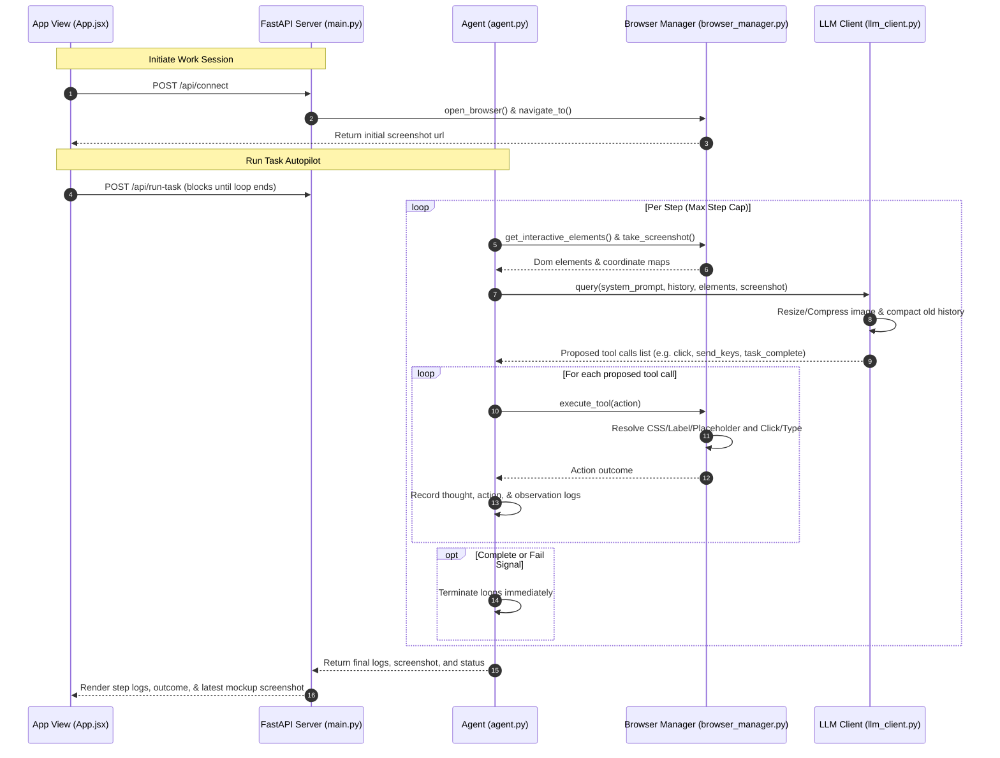

# 🚀 BrowseIQ

BrowseIQ is an LLM-driven browser autopilot designed to perceive and navigate page structures semantically—just like a human would. I built this project to explore how cognitive AI models can navigate form hierarchies, interact with screen elements, and execute complex workflows autonomously using Playwright. 

What started as a command-line tool has been refactored into a high-performance web dashboard featuring a Stripe-inspired homepage and a premium motion design system powered by Framer Motion.

---

## ✨ Features & Highlights

* **🧠 Cognitive Navigation**: Uses visual screenshots combined with a filtered semantic interactive element map to help text-only or vision LLMs reason step-by-step.
* **✨ Advanced Motion Design**: Smooth, intentional, and expensive page transitions (opacity, staggered elements, spring-loaded magnetic CTAs, and a soft ambient cursor glow) following design systems from Apple, Linear, and Vercel.
* **🔌 Multi-Provider LLM Engine**: Native support for Groq's high-speed LPU models (like Llama 3) and xAI's Grok endpoint, automatically routed based on your API credentials.
* **🛡️ Self-Healing Selectors**: If a coordinate click is intercepted or fails, the browser manager automatically falls back to accessibility labels, CSS selectors, forced events, or raw mouse coordinates.
* **💼 Session Persistence**: Preserves active context, cookies, and login states across multiple consecutive user requests.
* **📉 Token Optimization**: Compresses page screenshots into lightweight JPEGs (80% quality, max 800px) and strips older images from chat history to save up to 85% on token bills.

---

## 📂 Project Structure

The project is structured to keep the frontend interface, background automation services, and configurations decoupled:

```text
BrowseIQ/
├── agent/
│   ├── browser_manager.py # Playwright state logic & coordinate matching fallback routines
│   ├── tool_definitions.py# JSON schema descriptors for OpenAI tool calling compatibility
│   ├── tools.py           # Facade module acting as exporter for manager & definitions
│   ├── config.py          # Environment key auto-router and settings manager
│   ├── llm_client.py      # Vision compressor, history compactor, and OpenAI client wrapper
│   ├── theme.py           # Logging and console output visual styling cards
│   └── agent.py           # The core perceive-decide-act task loop
├── frontend/              # Single-page dashboard built with Vite-React
│   ├── src/
│   │   ├── components/
│   │   │   ├── Homepage.jsx     # Motion-oriented Stripe-inspired landing page
│   │   │   ├── Header.jsx       # Viewport-blur header navigation
│   │   │   ├── BrowserMockup.jsx# Live session screenshot mock viewport
│   │   │   └── TelemetryFeed.jsx# Colored terminal thought-action console
│   │   ├── services/
│   │   │   └── api.js           # Decoupled REST client service queries
│   │   ├── App.jsx              # Main React layout using AnimatePresence transitions
│   │   └── App.css              # Premium dark styles and shimmer animations
├── static/                # Target compilation directory for production builds
├── main.py                # FastAPI endpoints server & async agent queue coordinator
└── requirements.txt      # Backend Python dependencies
```

---

## 🔁 The Autopilot Cycle (Under the Hood)

BrowseIQ coordinates loops using a synchronized **perceive-decide-act** workflow:



---

## 🚀 Getting Started

### 1. Requirements
Make sure you have **Python 3.10+** and **Node.js** installed.

### 2. Setup Backend Environments
Clone the directory, install Python dependencies, and download Playwright Chromium binaries:
```bash
pip install -r requirements.txt
python3 -m playwright install chromium
```

### 3. Setup Frontend Workspace
Enter the frontend folder and install npm packages (which configures `framer-motion` and `lucide-react` icons):
```bash
cd frontend
npm install
```

### 4. Manage Environment Credentials
Create a `.env` file in the root directory:
```bash
cp .env.example .env
```
Open `.env` and fill out your Groq or xAI keys:
```ini
# For Groq Cloud (keys start with gsk_)
XAI_API_KEY=gsk_your_groq_key_here
XAI_API_BASE=https://api.groq.com/openai/v1
XAI_MODEL=llama-3.3-70b-versatile

# For xAI Grok (keys start with xai-)
# XAI_API_KEY=xai-your-grok-key-here
# XAI_API_BASE=https://api.x.ai/v1
# XAI_MODEL=grok-2-vision-1212
```

---

## 💻 Running the Application

### Production Mode (Single-command host)
To compile the React bundle into production static assets and serve it directly via FastAPI:
```bash
# 1. Compile React production build
cd frontend
npm run build

# 2. Start Uvicorn backend
cd ..
python3 main.py
```
Open **[http://127.0.0.1:8000](http://127.0.0.1:8000)** in your browser. Uvicorn is pre-configured to watch source files but ignore output logs, static assets, and screenshots to prevent server restart loops during automation execution.

### Development Mode (Vite Hot-Reload)
To develop with live hot-reloading (HMR):
1. **Start Backend**: `python3 main.py` in the root folder.
2. **Start Dev Server**: In a separate terminal tab:
   ```bash
   cd frontend
   npm run dev
   ```
3. Open **[http://localhost:5173](http://localhost:5173)**. Vite automatically proxies API connections and screenshot directories to the backend port.

---

## 🌐 Deployment (e.g. Vercel)

BrowseIQ can be deployed for remote access. Due to the distinct architectural requirements of the frontend and the backend, they should be deployed as follows:

### 1. Frontend (Vercel)
The React/Vite frontend is fully optimized to be deployed to **Vercel** as a standalone static site.
* **Root Directory**: Set Vercel's root directory to `frontend/`.
* **Build Configuration**: Build command is `npm run build`, and output directory is `dist` (the config dynamically falls back from `static/` to `dist` when `VERCEL=1` is detected).
* **API Routing**: Define the environment variable `VITE_API_BASE_URL` in the Vercel Dashboard, pointing to your deployed backend domain (e.g., `https://browseiq-backend.onrender.com`). Do not include a trailing slash.

### 2. Backend (Render, Railway, Fly.io, or VPS)
Because the backend coordinates execution using a persistent background worker queue and launches **Playwright Chromium browsers**, **it cannot be hosted on Vercel Serverless Functions**. Serverless hosts enforce request timeouts, do not persist background thread contexts, and lack Chromium system libraries.
* **Target Platforms**: Deploy the backend to a persistent container runtime like **Render**, **Railway**, **Fly.io**, or any VPS.
* **Build Command**: `pip install -r requirements.txt && python3 -m playwright install chromium`
* **CORS Support**: The FastAPI server is pre-configured with CORS middleware to accept incoming cross-origin requests from your Vercel frontend URL.

---

## 🧪 Testing
Run the Python test suite to verify agent routines and tool mapping functions:
```bash
python3 -m unittest discover tests
```

---

## 💡 Cost, Token, & Reload Optimizations

* **Image Resizing**: The PIL library formats screenshots into compressed JPEGs (80% quality, max width 800px), converting MBs of raw data into lightweight KBs and preserving tokens.
* **Uvicorn Reload Exclusions**: Excludes paths like `logs/*`, `screenshots/*`, and `static/*` from Uvicorn's watch triggers, ensuring that runtime telemetry and screenshots do not cause server abort loops.
* **Scoping Heuristics**: The system prompt contains explicit directives instructing the LLM to complete single-action tasks (e.g. "click login") immediately and stop rather than initiating speculative helper sub-tasks.
